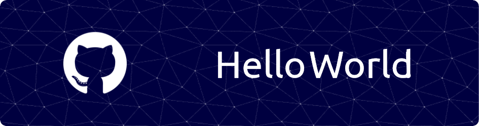

## Hello there 👋 I’m Nareshkumar
- 🌱 I’m currently learning Web Development
- 📫 How to reach me
   
- 😄 Pronouns: n-oob
- ⚡ Fun fact: ...

### Programming Languages:
    
### Frameworks and libraries:
  
### Tools and Technologies
   

  

<!---
R-Nareshkumar/R-Nareshkumar is a ✨ special ✨ repository because its `README.md` (this file) appears on your GitHub profile.
You can click the Preview link to take a look at your changes.
--->
